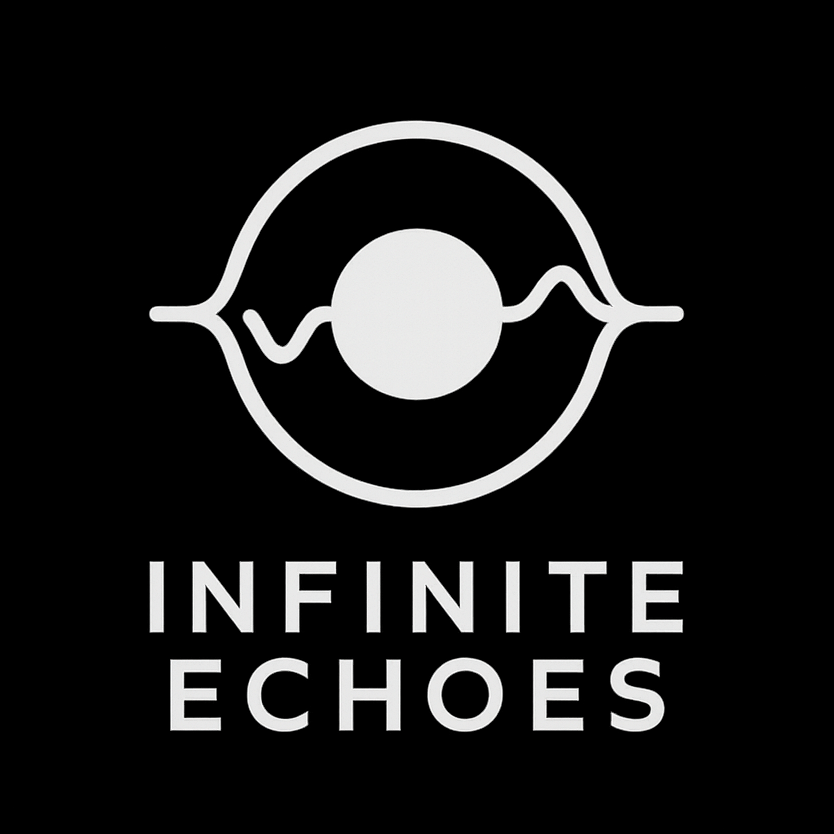

<div align="center">
  
</div>

Infinite Echoes is an interactive audio creation game that allows users to
create, save, and share unique audio compositions as NFTs on the TON blockchain.
The application features a drag-and-drop interface for building audio graphs
with various sound generators, effects, and modifiers.

### Key Features

- Visual audio graph creation with intuitive drag-and-drop interface
- Real-time audio preview and playback
- TON wallet integration for minting and trading audio NFTs
- Cross-platform support via WebAssembly

## Installation and Dependencies

Before running the project, you'll need to install the following dependencies:

Install Rust and Cargo (if not already installed)
```bash
curl --proto '=https' --tlsv1.2 -sSf https://sh.rustup.rs | sh
```

Add WebAssembly target
```bash
rustup target add wasm32-unknown-unknown
```

Install required tools
```bash
cargo install wasm-bindgen-cli
cargo install just
```

## Building, Running, and Deployment

All the necessary commands are defined in [justfile](./justfile)

Building the WebAssembly binary
```bash
just build
```

Running the development server
```bash
just run
```

This will start a local server at http://localhost:1234

Creating a deployment package for static file server:

```bash
just pack
```

This will create a `deploy` directory with all the necessary files for deployment.

## Development

The project is structured as a Rust application that compiles to WebAssembly, with a web frontend for user interaction.

- `game/` - Core application logic and audio processing
- `server/` - Development server for local testing
- `web/` - Web frontend assets and integration code
- `resources/` - Static assets like images and audio samples

## License

This project is licensed under the MIT License - see the LICENSE file for details.
